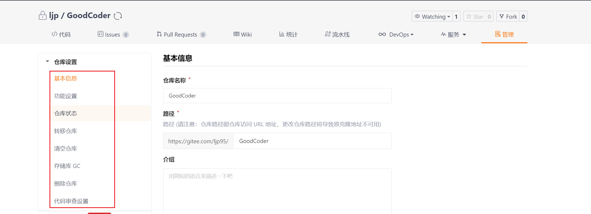

# GoodCoder

## 01 项目说明与基础设置

用途：用于记录日常学习笔记，同时同步至GitHub、Gitee两个托管平台

仓库地址

- GitHub：https://github.com/lujinpeng95/GoodCoder
- Gitee：https://gitee.com/ljp95/GoodCoder

使用步骤

```shell
# 第一次拉取项目
git clone xxx
 
# 每次都拉取下最新更新
git pull
# 修改文件后执行脚步上传到两个托管平台
# Win平台；若不写commit，则默认为“日常更新”
.\quickUpload.bat "bat脚步更新"
# 全平台；若不写commit，则默认为“日常更新”
.\quickUpload.sh "shell脚步更新"
```

初始化项目，并同时托管两个平台的具体方法如下

【注】比较关键的步骤是

```shell
git remote add github-origin git@github.com:lujinpeng95/GoodCoder.git
git remote add gitee-origin git@gitee.com:ljp95/GoodCoder.git 
```


### 1-1 Git设置

#### 步骤

- ① 安装Git：https://git-scm.com/downloads （安装说明文档-https://www.windows11.pro/5639.html）

- ② Git命令与设置

  - 补充：[Window下git配置文件的位置](https://blog.csdn.net/Tony__Jaa/article/details/107630505) 『C:\Users\xxx\ .gitconfig』

  ```pow
  # 查看git版本号
  git --version
  
  # 随便起的名字
  git config --global user.name "xxx"
  # 提交者的邮箱，若github/gitee上有该邮箱注册的账户，则会显示该账户贡献的代码
  git config --global user.email "xxx"
  
  # 查看全局变量设置情况
  git config --global --list
  ```

- ③ 生成秘钥（说明文档：https://gitee.com/help/articles/4181#article-header0）

  ```powershell
  # 可以提前进入该目录查看，若存在该目录，表明之前生成过SSH Key
  cd ~/.ssh
  
  # 生成SSH Key公私钥对；这里的xxx@xxx.com只是生成的 sshkey 的名称，并不约束或要求具体命名为某个邮箱（可以不必是邮箱）。
  ssh-keygen -t ed25519 -C "xxxxx@xxxxx.com"  
  
  # 按提示按下三次回车
  
  # 读取公钥内容，并复制到剪切板
  cat ~/.ssh/id_ed25519.pub
  ```

- ④ 托管平台配置公钥（2022.06.26时的界面操作方式）

  - GitHub：右侧头像 --- 『Settings』--- 『Access』--- 『SSH and GPG keys』；将如上生成的公钥粘贴在下图所示位置

    

  - Gitee：右侧头像 --- 『设置』--- 『安全设置』--- 『SSH公钥』；将如上生成的公钥粘贴在下图所示位置

    

- ⑤ 检测是否配置成功：首次使用需要确认并添加主机到本机SSH可信列表。若返回 `Hi XXX! You've successfully authenticated, but GitHub/Gitee.com does not provide shell access.` 内容，则证明添加成功。

  ```powershell
  # 检测GitHub是否配置成功
  ssh -T git@github.com
  
  # 检测Gitee是否配置成功
  ssh -T git@gitee.com
  ```


#### 常见问题

##### 多端同步git报错

- mac端：[解决 fatal: Not a git repository (or any of the parent directories): .git 问题](https://blog.csdn.net/wenb1bai/article/details/89363588) 

  ```
  git init
  ```

- 【有误】win端：[git报错bad signature和index file corrupt的处理方法](https://blog.csdn.net/weixin_36995355/article/details/89509632)

  - 博客中的方法（reset），会重置全部git设置，远端分支名称也会被重置；并且会导致各种文件错误


##### 上传文件失败

- 报错信息：[error: src refspec xxx does not match any / error: failed to push some refs to](https://blog.csdn.net/u014361280/article/details/109703556)

- 本质原因：远程没有指定的分支名的分支

- 可能的报错原因：

  - ① 常用的push命令：`git push origin master`

  - ②  Github受到"Black Lives Matter"运动的影响，从2020年10月1日起，在该平台上创建的所有新的源代码仓库将默认被命名为 “main”，而不是原先的"master"

    

- 解决方案：

  ```powershell
  # 修改本地master分支名，改为main
  git branch -m master main
  
  # 提交代码时，push到main分支
  git push origin main
  ```

  

##### 中文乱码问题

- 参考博文：https://cloud.tencent.com/developer/article/1728748

- 补充阅读：
  - https://cloud.tencent.com/developer/article/1541611?from=article.detail.1728748
  - https://blog.csdn.net/qq_34707272/article/details/105971251
  - 若win系统通过bat提交，导致中文乱码，参见：[Bat脚步中文乱码问题](#Bat脚步中文乱码)
- 设置git编码

```powershell
git config --global core.quotepath false 
git config --global gui.encoding utf-8
git config --global i18n.commit.encoding utf-8 
git config --global i18n.logoutputencoding utf-8 
```

- 设置环境变量

```powershell
# bash环境
export LESSCHARSET=utf-8

# cmd环境
set LESSCHARSET=utf-8
```

- windows配置系统变量：『LESSCHARSET utf-8』


### 1-2 托管平台设置

#### 上传多平台配置

参考博文：[一个项目用Git分别上传多个平台(github、gitee、gitlab)](https://blog.csdn.net/weixin_43193877/article/details/122002796?spm=1001.2101.3001.6661.1&utm_medium=distribute.pc_relevant_t0.none-task-blog-2%7Edefault%7ECTRLIST%7ERate-1-122002796-blog-107226141.pc_relevant_paycolumn_v3&depth_1-utm_source=distribute.pc_relevant_t0.none-task-blog-2%7Edefault%7ECTRLIST%7ERate-1-122002796-blog-107226141.pc_relevant_paycolumn_v3&utm_relevant_index=1)

步骤：

- ① 各托管平台新建项目

- ② 按如上设置，在本地生成公私钥，将公钥配置在各个托管平台，并检测配置成功

- ③ 获取平台项目路径

  

  

- ④ 配置平台上传路径：

  ```powershell
  git remote add github-origin git@github.com:lujinpeng95/GoodCoder.git
  git remote add gitee-origin git@gitee.com:ljp95/GoodCoder.git 
  ```

- ⑤ 编写上传脚步：win平台若有编码问题，参见：[Bat脚步中文乱码问题](#Bat脚步中文乱码)

  - Win：https://www.imooc.com/wenda/detail/606826（FFIVE的答案）；[批处理中setlocal enabledelayedexpansion](https://www.jb51.net/article/29323.htm)

  ```bash
  :: win-bat
  git add .
  
  set "commit=%~1"
  setlocal EnableDelayedExpansion
  if "!commit!"==""  (
  	git commit -m "日常更新"
  ) else (
  	git commit -m %1
  )
  
  git push github-origin main
  git push gitee-origin main
  pause
  ```
  
  - Unix：[尝试实现bat中pause功能](https://blog.csdn.net/weixin_36254379/article/details/116821423)
  
  ```shell
  # mac/linux-shell
  git add .
  
  if [ -z "$1" ]; then
      git commit -m "日常更新"
      else
          git commit -m $1
  fi
  
  git push github-origin main
  git push gitee-origin main
  echo 请按任意键继续. . .
  read -n 1
  ```
  
- ⑥ 实际使用：若win平台要运行shell脚步，需安装『Git Bash』（[并将git的cmd目录配置到环境变量中](https://www.cnblogs.com/woods1815/p/11026658.html)）

  ```shell
  # Win平台；若不写commit，则默认为“日常更新”
  .\quickUpload.bat "bat脚步更新"
  
  # 全平台；若不写commit，则默认为“日常更新”
  .\quickUpload.sh "shell脚步更新"
  ```

  


#### 仓库权限修改（私有/公有）

如下说明为 2022.06.27日界面操作

**GitHub**

- 进入具体项目仓库，点击『Setting』

  

- 拉至最下面『Danger Zone』，点击按钮『Change visibility』，修改仓库权限，并输入项目名称确认

  

- 【补充】修改项目名称

  

  


**Gitee**

- 基本同GitHub；在项目『管理』项下，可以进行权限修改（需拉到入图所示界面的最下面，选择『是否开源』）、项目名称修改、仓库删除等操作

  


### 1-3 Win系统设置

#### Bat脚步中文乱码

- 参考博文：[解决window的bat脚本执行出现中文乱码的问题](https://www.cnblogs.com/onelikeone/p/11965839.html)：

- 原理：批处理文件，是以ANSI编码处理的；如果通过将txt文件（默认UTF-8）修改后缀改为bat文件，会出现中文乱码的问题。
- 解决方案：将要修改的txt文件，选择『另存为』，然后修改文件后缀为bat，并将编码格式设置为『ANSI』
- 补充阅读：
  - [查看端口使用进程的方式](https://blog.csdn.net/weixin_45640009/article/details/120815019)
  - [pause命令](https://blog.csdn.net/baidu_35761016/article/details/53018176)：Dos命令中的一个命令，让bat任务暂停，并屏幕输出提示信息"Press any key to continue...“ 


### 其他设置

#### 输入法

##### 方引号/直角引号

- 输入法输出 『方引号/直角引号』：搜狗输入法『更多设置』--- 『高级』--- 『自定义短语设置』

  


#### 科学上网

- ShadowsocksR端口被占用问题：[问题解决： SSR 的 1080 端口被占用](https://blog.csdn.net/longintchar/article/details/99005409?spm=1001.2101.3001.6661.1&utm_medium=distribute.pc_relevant_t0.none-task-blog-2%7Edefault%7ECTRLIST%7Edefault-1-99005409-blog-120815019.pc_relevant_multi_platform_whitelistv1&depth_1-utm_source=distribute.pc_relevant_t0.none-task-blog-2%7Edefault%7ECTRLIST%7Edefault-1-99005409-blog-120815019.pc_relevant_multi_platform_whitelistv1&utm_relevant_index=1)

  - 找到安装目录 --- 打开『gui-config.json』--- 修改"localPort"字段的值，然后重启

  ```
  "localPort" : 1088,
  ```


### 常用快捷键

#### 终端

清除一行：『ctrl + w』/ 『ctrl + a』


#### 文本

移至行首/尾：『Home/End』（有些笔记本可以用 『Fn + 左/右键』代替 Home/End）

左/右移动一个单词：『ctrl + 左/右键』
